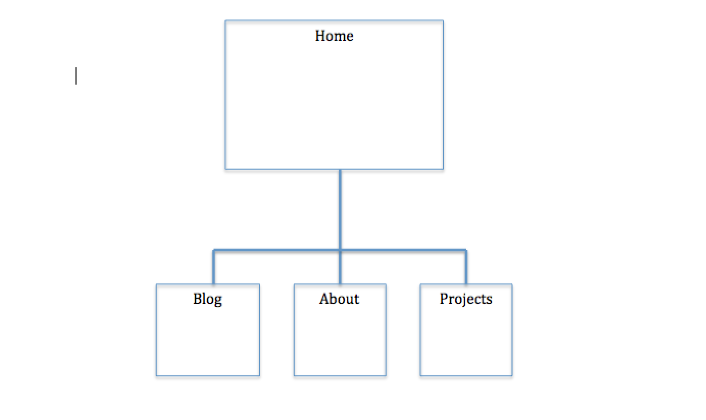

# Site Map Reflection and Submission

## What are the 6 Phases of Web Design?

The 6 phases of web design are:
 - Information Gathering
 - Planning
 - Design
 - Development
 - Testing and Delivery
 - Maintenance

## What is your site's primary goal or purpose? What kind of content will your site feature?

The primary goal/purpose of my site is to be a professional website where i can show my work history, background, passion and projects along with a blog. The content will be updated with my projects and personal thoughts.

## What is your target audience's interests and how do you see your site addressing them?

My target audience is employers/people in the developing industry. My site will present employers with my portfolio along with some background about me and other information. For people in the tech industry, my blog show others a different perspective to a concept or something along those lines.

## What is the primary "action" the user should take when coming to your site? Do you want them to search for information, contact you, or see your portfolio? It's ok to have several actions at once, or different actions for different kinds of visitors.

The primary action would be to check out my blog/portfolio for all visitors. For potential employers, I want them to see my portfolio, background and contact information. For everyone else, I would like them to see my background, portfolio and blog. If they would like, they can contact me as well.

## What are the main things someone should know about design and user experience?

Design and User experience helps websites create a good experience for a visitor. User experience is how a person feels when they're interacting with the system (website, web app, software). The design aspect is how the website should look and feel. A website for teenagers and a website for financial institutions will look different. There are a lot of planning and research done with design and user experience. Small changes to a website could possibly lead to major profits.

## What is user experience design and why is it valuable?

User experience design is, like mentioned in the previous question, helps create a good experience for a person visiting the website. User experience designers evaluate how users will feel, ease of use, efficiency in performing tasks, etc. User experience design is valuable becasue it helps deal with the users' needs. If the users were unhappy, then the service being provided may not be running for long.

## Which parts of the challenge did you find tedious?

None. I felt like all the challenges were fair.

## Reflection

This challenge was interesting. I've never really thought about UX Design and how it worked. It's cool to see and learn about how it has changed from back then. There used to be no research and just create designs based on what looked aesthetic. Now, it's more of accessibility and all about the user. It makes a lot of sense though and obvious.