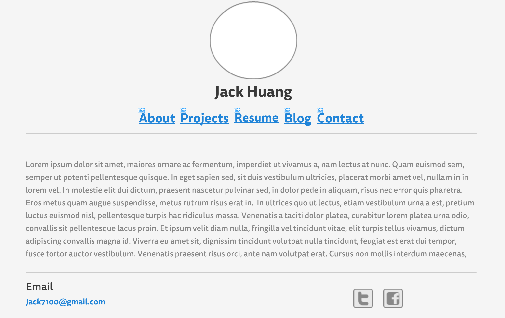
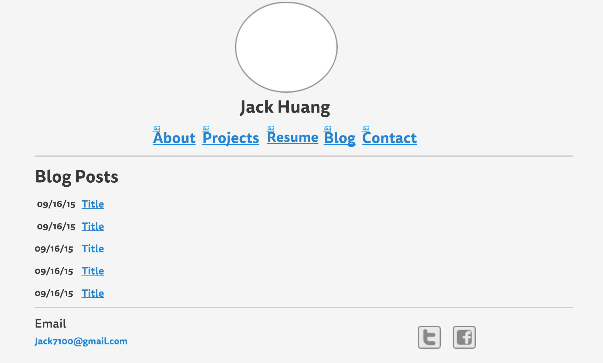

# Wireframe Images

The wireframe index page

The blog index page

## Questions

- What is a wireframe?

Wireframe is a sketch of how everything will be placed on your website. It's like an architectual blueprint. It's like a sketch/design of where your header, content, buttons, footer, etc will be placed. It's a layout.

- What are the benefits of wireframing?

It allows the designer to figure out the layout/where everything will be before deciding on colors and things like that.

- Did you enjoy wireframing your website?

Yes i did. I was able to visualize how I want my website to look like and keep it as a reference for when i start putting it together.

- Did your revise your wireframe or stick with your first idea?

I revised it. My first idea was to have my links as buttons but I didn't like it so i changed it to just links. I had the straight horizontal line above the links as well but moved it below the links because I felt like it looked better and kept the content in an enclosed space.

- What questions did you ask during this challenge? What resources did you find to help you answer them?

I had questions on which wireframe resource to use to create it. I asked on the slack channel but ultimately went with one that was on a list provided.

- Which parts of the challenge did you enjoy and which parts did you find tedious?

I found making the wireframe enjoyable. I did not really find anything tedious.

## Reflection

If you had asked me what a wireframe was before this challenge, I wouldn't have known. I've learned how to create a wireframe along with the importance and usage. I didn't really have any issues in this challenge. I found it somewhat fun.