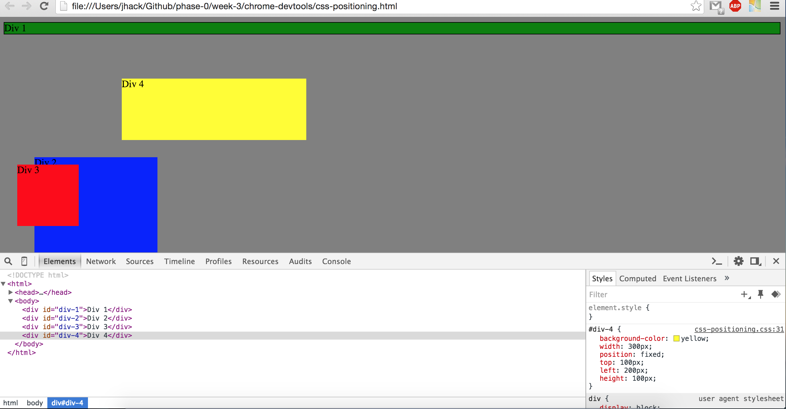
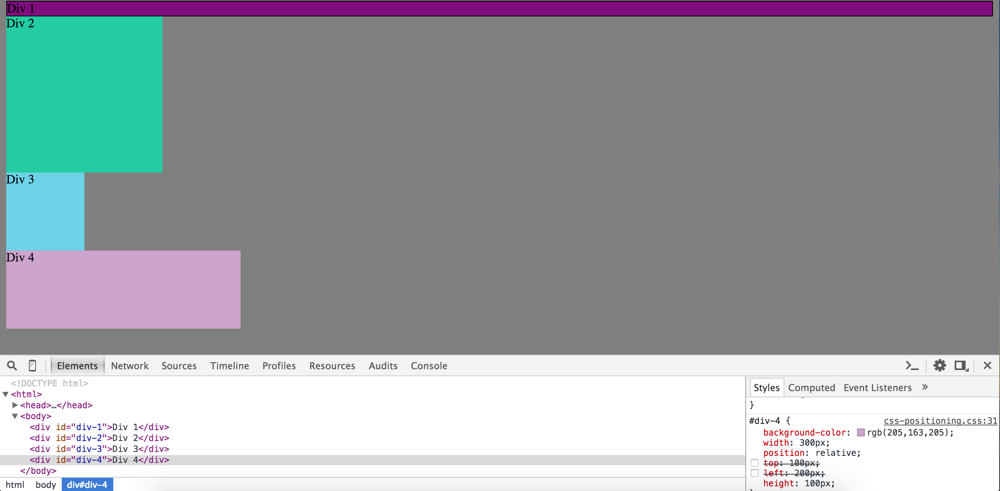
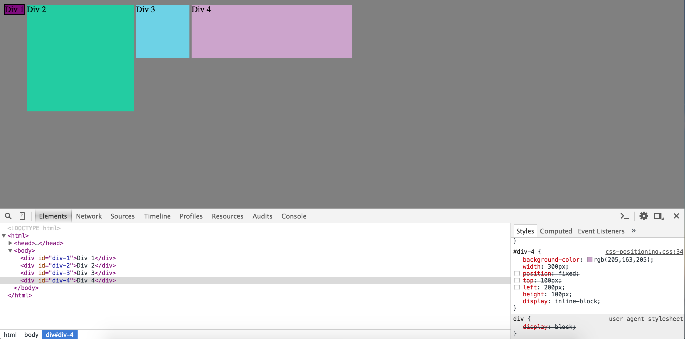
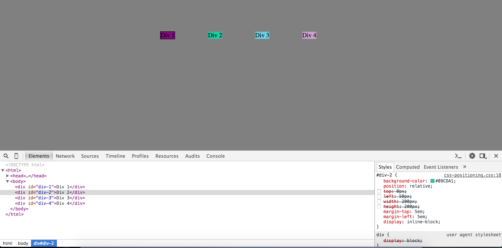
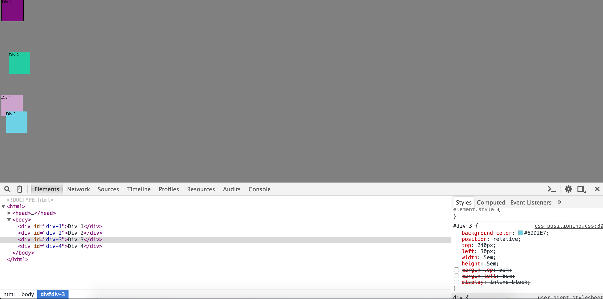
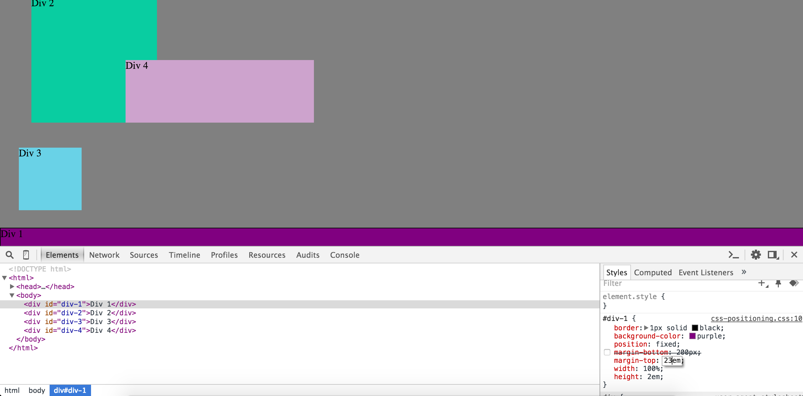
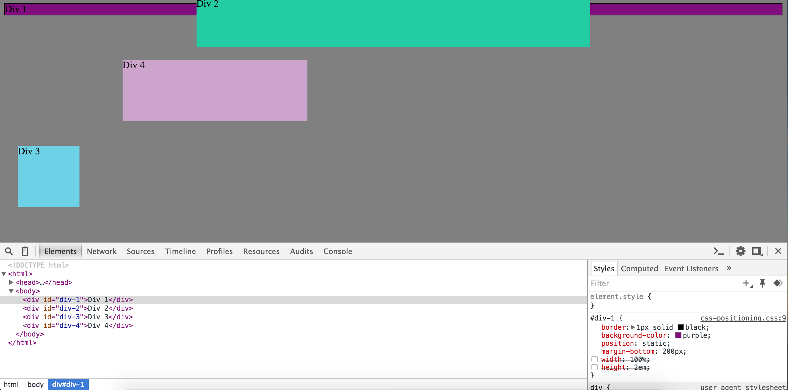
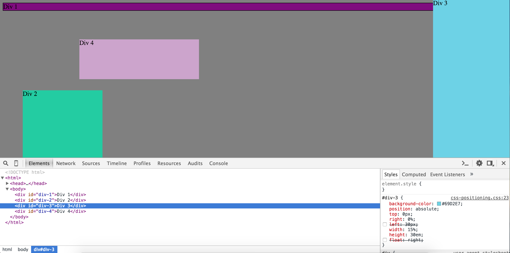
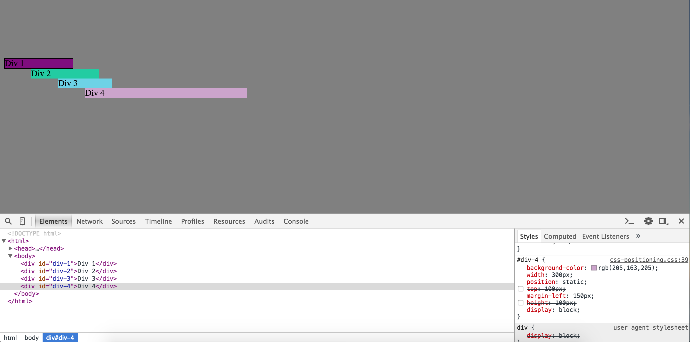

#3.4 Chrome Dev Tools

## Questions

- How can you use Chrome's DevTools inspector to help you format or position elements?

Chrome DevTool allows us to edit the file as we go and see what's going on. It's easy to edit the file and adjust. For example, we would be able to edit our margins and change the margin 1 by 1 until we get the view we want. We can see it in effect as we type it out.

- How can you resize elements on the DOM using CSS?

You can create classes in the elements and use CSS to adjust those classes. For example, i can set a p tag to have a class of paragraph and in CSS i would simply just do .paragraph { attributes/tags here }. I can resize elements by using properties such as width, height, float, margin, and more.

- What are the differences between Absolute, Fixed, Static, and Relative positioning? Which did you find easiest to use? Which was most difficult?

Absolute means that the position would be relative to the non-static previous element. It allows the element to overlap other elements. Fixed positioning means that it will move along with the browser. If i were to scroll down, I would still see the element as i scroll. Static positioning is the default value, it's the order the elements were given. So if i had one div above the div i'm editing, it would be placed below that div. Lastly, relative positoning is positioned to the normal position. So for example, if i were to give the element a top:10px, it would move 10px to the top. I found relative/static positon to be the easiest to use. I was able to adjust my element with the left, top, right properties. The most difficult would probably be absolute because it stacks the element after the previous one so there's not much adjustment that could be made.

- What are the differences between Margin, Border, and Padding?

Margin is the outer area of the element. It's the outermost area. It's like the coat a person wears. The border is like a sweater that a person wears and padding would be the shirt. So there's some space between each. If you wanted to change the outermost area you would go for the margin. If you wanted to create a border, or horizontal lines, you could adjust the border. The border is in between the margin and padding. The padding is the space between the text/element and the border.

- What was your impression of this challenge overall? (love, hate, and why?)

I loved this challenge. It wasn't an easy challenge for me but I learned a lot from it. During the exercises, I had trouble from 3 to 9. I was able to figure things out and ask my pair for some advice. It was a good learning exercise. I learned a lot from the challenge and different ways I can do things in CSS.