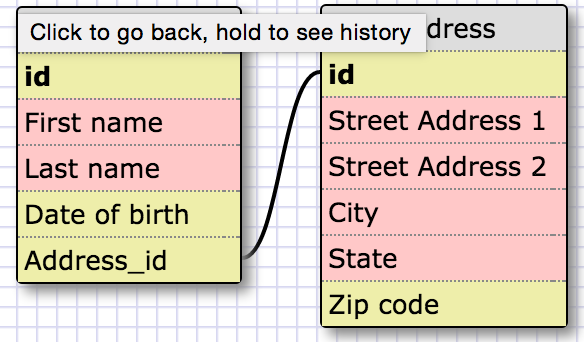
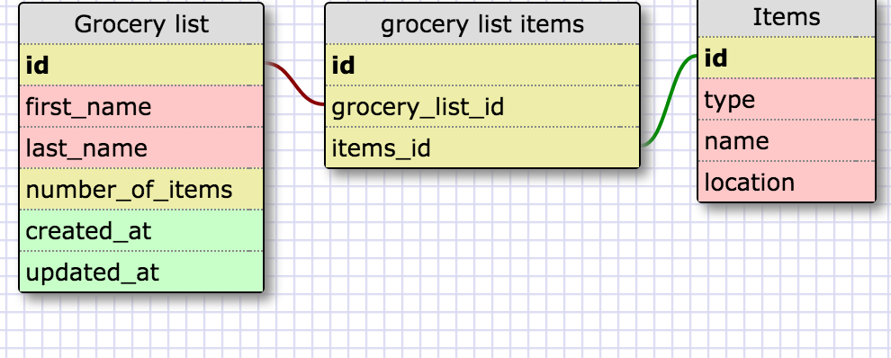

#Release 2: Create a One-to-One schema

I used the example in Release 1 as an example. In my example, I'm assuming that a person has only ONE primary address. So the person has a home and the home only belongs to the person.

#Release 4: Refactor

In my grocery list table, i have the persons first and last name to identify the grocery list to the person. Then i have a created at and updated at field as well. This is to help us know when the list was created and when items were retrieved.

#Release 6: Reflect

- What is a one-to-one database?

A one-to-one database is a database that contains a single relationship to another table. It's like how a country has one capital or a car has one engine.

- When would you use a one-to-one database? (Think generally, not in terms of the example you created).

A one-to-one database should be used when a group of fields can be empty.

- What is a many-to-many database?

It's when one table can have multiple instances of the second table. An example is books and authors. A book can have many authors and an author can write multiple books.

- When would you use a many-to-many database? (Think generally, not in terms of the example you created).

Many to many database would be used in databases where both tables have a lot of each other. Examples would be like students and classes. A student has many classes and classes have many students.

- What is confusing about database schemas? What makes sense?

The type of databases are a little confusing to me. One-to-many/One-to-one/Many-to-many databases are a little confusing right now. I understand the usage of databases and how it works. We create fields in the tables and can connect them to another table by foreign and primary keys.
